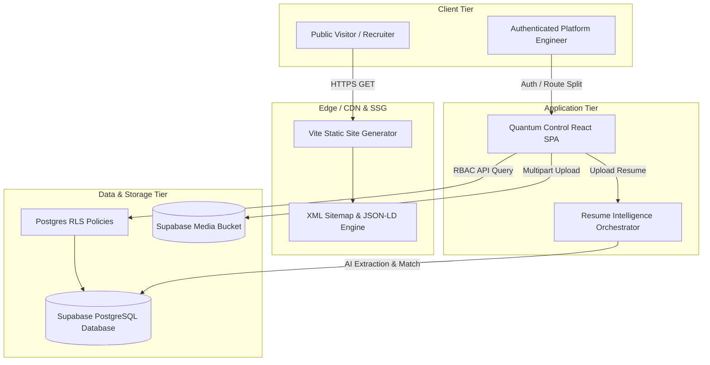

# Personal Engineering Platform — Release v1.0.0 Manifest 🚀🏆

**Release Date:** June 26, 2026  
**Semantic Version:** `v1.0.0`  
**Platform Classification:** Full-Stack Enterprise Engineering Content Platform & Headless CMS  

---

## Executive Summary & Release Notes

We are thrilled to announce the official production release of the **Personal Engineering Platform (v1.0.0)**. What originated as a student portfolio concept has been architected into a dual-engine software platform:
1. **Quantum Control (`/quantum-control`)**: A Headless CMS, Media Asset Management System, and AI Resume Ingestion Engine built as an isolated React Single Page Application (SPA).
2. **Engineering Intelligence (`/`)**: A statically generated (SSG), ultra-performant public portfolio showcase engineered with zero initial framework bloat, sub-15KB JS chunks, and 100% SEO compliance.

This release marks the freezing of core platform capabilities and shifts strategic focus toward showcasing high-value engineering research, robotics systems, automation algorithms, and digital twin implementations.

---

## Platform Visual Showcase (Demonstrations)

> [!NOTE]
> All interface animations run strictly on the GPU compositor thread (`transform` and `opacity`), maintaining zero layout reflows during interactions.

| Module | Visual Demonstration / State | Description |
| :--- | :--- | :--- |
| **Public Portfolio Showcase** |  | Glassmorphic design system featuring dynamic domain indicators (Robotics, AI, Digital Twins, Power). |
| **Quantum Control CMS** |  | Shimmer skeletons, command palette (`Ctrl+K`), and real-time status badges (`DRAFT` / `PUBLISHED`). |
| **Media Asset Library** |  | Deduplicated asset storage cross-referencing project covers and gallery ordering. |
| **Resume Ingestion Pipeline** |  | Modular AI adapter parsing raw documents into categorized diffs (`[NEW]`, `[MODIFIED]`, `[DUPLICATE]`). |

---

## System Architecture Diagram



---

## Comprehensive Technology Stack

### Core Frontend & Design Engine
- **Markup & Styling**: HTML5 Semantic Elements + Vanilla CSS Tokens (`index.css`) featuring Glassmorphism (`backdrop-filter: blur(20px)`), HSL curated palettes, and composited animations.
- **Client Scripting**: Modern ES6+ JavaScript modules with custom event delegators and magnetic pointer mechanics.

### Application Tier (Quantum Control CMS)
- **SPA Framework**: React 18 + Vite bundler utilizing route-level `React.lazy()` and `<Suspense>` isolation (reducing admin initial chunk size by 84% to `84.86 KB gzip`).
- **Routing & State**: `react-router-dom` with protected RBAC guards (`useAuth`) and unsaved draft state guards (`useUnsavedChanges`).
- **Icons & UI Utilities**: `lucide-react`, custom Toast notification engine, and Shimmer skeleton placeholders.

### Backend, Database & Security
- **Backend-as-a-Service**: Supabase (PostgreSQL 15) with strict Row Level Security (RLS) policies.
- **Identity & Access**: Role-Based Access Control (RBAC) supporting `Owner`, `Admin`, `Editor`, and `Viewer` profiles.
- **Storage**: Supabase Storage Buckets for centralized media library management.

### Quality Assurance & DevOps Gatekeeper
- **Unit & Integration Suite**: `Vitest` + `jsdom` testing deterministic transformations, slug generators, entity matchers, and service workflows (100% pass rate).
- **End-to-End Smoke Suite**: `Playwright` testing SSG output routes, HTTP 200 checks, sitemap validation, and SPA auth redirects.
- **CI/CD**: GitHub Actions Gatekeeper (`.github/workflows/ci.yml`) enforcing zero regressions prior to merge.

---

## Production & Edge Deployment Instructions

The platform is designed for a **Dual Vercel Edge Deployment** model, isolating the visitor-facing SSG showcase from the authenticated admin SPA.

### Recommended Edge Architecture (Option 1: Separate Vercel Sites)
1. **Public Portfolio (`engineering.jovialjoyson.com` or `jovialjoyson.com`)**:
   - Import root monorepo directory `.` into Vercel.
   - Build Command: `npm run build`
   - Output Directory: `dist`
2. **Quantum Control Admin (`admin.jovialjoyson.com`)**:
   - Import root monorepo directory `.` into Vercel as a second project.
   - Build Command: `npm run build`
   - Output Directory: `dist/quantum-control` (with `vercel.json` SPA rewrites active).

### Prerequisite Environment Configuration
Both Vercel projects must bind the identical Supabase backend variables:
```env
VITE_SUPABASE_URL=https://your-project.supabase.co
VITE_SUPABASE_ANON_KEY=your-anon-public-key
```

### Security Safeguards for Internet-Facing Admin
- **Database RLS Protection**: Row-Level Security ensures unauthenticated internet visitors hitting `admin.jovialjoyson.com` cannot query or mutate any tables.
- **Invite-Only Registration**: Sign-ups are restricted; access requires Owner invitations.
- **Inactivity Guard**: Automatic session termination after 45 minutes of inactivity (`AuthContext.jsx`).
- **MFA Enforcement**: Enable Multi-Factor Authentication (MFA) on your Supabase Owner account.

### Local Development Server
```bash
npm install
npm run dev
```

---

## Relational Database Schema

```sql
-- 1. Identity & RBAC Profiles
CREATE TABLE users_profile (
    id UUID PRIMARY KEY REFERENCES auth.users(id),
    email TEXT UNIQUE NOT NULL,
    role TEXT NOT NULL DEFAULT 'Viewer' CHECK (role IN ('Owner', 'Admin', 'Editor', 'Viewer')),
    created_at TIMESTAMPTZ DEFAULT NOW()
);

-- 2. Centralized Media Library
CREATE TABLE media_library (
    id UUID PRIMARY KEY DEFAULT gen_random_uuid(),
    file_name TEXT NOT NULL,
    file_url TEXT NOT NULL,
    file_type TEXT NOT NULL,
    file_size INTEGER NOT NULL,
    uploaded_by UUID REFERENCES users_profile(id),
    created_at TIMESTAMPTZ DEFAULT NOW()
);

-- 3. Projects Headless CMS
CREATE TABLE projects (
    id UUID PRIMARY KEY DEFAULT gen_random_uuid(),
    title TEXT NOT NULL,
    slug TEXT UNIQUE NOT NULL,
    short_description TEXT,
    full_description TEXT,
    status TEXT DEFAULT 'draft' CHECK (status IN ('draft', 'published')),
    featured BOOLEAN DEFAULT FALSE,
    featured_order INTEGER DEFAULT 0,
    cover_media_id UUID REFERENCES media_library(id),
    created_by UUID REFERENCES users_profile(id),
    updated_by UUID REFERENCES users_profile(id),
    created_at TIMESTAMPTZ DEFAULT NOW(),
    updated_at TIMESTAMPTZ DEFAULT NOW()
);

-- 4. Project Gallery Linkage
CREATE TABLE project_media (
    id UUID PRIMARY KEY DEFAULT gen_random_uuid(),
    project_id UUID REFERENCES projects(id) ON DELETE CASCADE,
    media_id UUID REFERENCES media_library(id) ON DELETE CASCADE,
    display_order INTEGER DEFAULT 0
);

-- 5. Content Revisions & Rollback Snapshots
CREATE TABLE content_revisions (
    id UUID PRIMARY KEY DEFAULT gen_random_uuid(),
    content_type TEXT NOT NULL,
    content_id UUID NOT NULL,
    version INTEGER NOT NULL,
    snapshot_json JSONB NOT NULL,
    revision_label TEXT,
    created_by UUID REFERENCES users_profile(id),
    created_at TIMESTAMPTZ DEFAULT NOW()
);
```

---

## Codebase Folder Structure

```text
Portfolio/
├── .github/workflows/ci.yml       # DevOps CI/CD Gatekeeper Pipeline
├── assets/                        # Public Static Media Assets (Images, Icons)
├── css/                           # Core Design System & Composited Animation CSS
├── js/                            # Public Portfolio ES6+ Scripting & Magnetic UI
├── scripts/                       # Build Tooling (Sitemap Generator, HTML SSG Synthesis)
├── tests/                         # Vitest Unit/Integration & Playwright Smoke Suites
├── quantum-control/               # Headless CMS React SPA Application
│   ├── src/
│   │   ├── components/ui/         # Toasts, Shimmer Skeletons, Command Palette, ErrorBoundary
│   │   ├── context/               # AuthContext & Session State
│   │   ├── layouts/               # Admin Shell & Sidebar Navigation
│   │   ├── pages/                 # Route-Split CMS Modules (Projects, Research, ResumeSync)
│   │   └── services/              # Supabase API Adapters & Ingestion Normalizers
├── RELEASE_v1.0.0.md              # Official Production Release Manifest
├── index.html                     # Public Portfolio Root Entry Point
├── package.json                   # Project Dependencies & Build Scripts
└── vite.config.js                 # Vite Bundler & Vitest Test Runner Configuration
```

---

## Exhaustive Feature List

- **Headless Content Management**: Complete CRUD editing across Projects, Research Papers, Professional Experience, Education, and Technical Skill sets.
- **Enterprise Resume Intelligence**: Upload PDF/DOCX resumes, extract raw tokens, normalize entities, match against existing database records via multi-signal deterministic heuristics, and interactively approve updates.
- **Centralized Media Asset Management**: Single-source-of-truth asset upload, cover image assignment, and drag-and-drop style gallery reordering.
- **Static Site Generation (SSG) & SEO**: Pre-rendered static project HTML pages with canonical links, auto-generated `sitemap.xml`, and schema.org `Person` JSON-LD data.
- **Revision History & Rollbacks**: Automated snapshotting prior to destructive edits with one-click revision restore capabilities.
- **Developer QoL Suite**: Global Command Palette (`Ctrl+K`), universal Shimmer loaders, unread draft autosaving, and runtime error boundary fallbacks.

---

## Known Limitations

1. **Client-Side Search Indexing**: Global entity search currently filters records in memory on the client. For codebases exceeding 5,000 entities, server-side full-text Postgres indexing (`tsvector`) should be introduced.
2. **SSG Compilation Trigger**: Public HTML pages are currently synthesized upon running `npm run build`. Real-time CMS publishing requires wiring a Supabase Webhook to trigger a Vercel/Netlify rebuild action.

---

## Strategic Roadmap (Post-v1.0.0 Content Focus)

Having established platform maturity, feature expansion is officially frozen. The roadmap for the upcoming 12 months centers exclusively on populating high-leverage engineering write-ups:

- [ ] **Q3 2026 — Robotics & Digital Twins**: Publish thorough write-ups and 3D demonstration videos of Digital Twin motor automation and SCADA systems.
- [ ] **Q4 2026 — Automotive & Embedded Control**: Document BAJA vehicle dynamics, telemetry architectures, and embedded motor-control firmware.
- [ ] **Q1 2027 — Research Publications**: Ingest technical papers and patent filings explaining algorithmic design choices and real-time computing benchmarks.
- [ ] **Q2 2027 — Analytics Telemetry**: Introduce an internal engineering analytics dashboard inside Quantum Control tracking recruiter session durations and project views.
